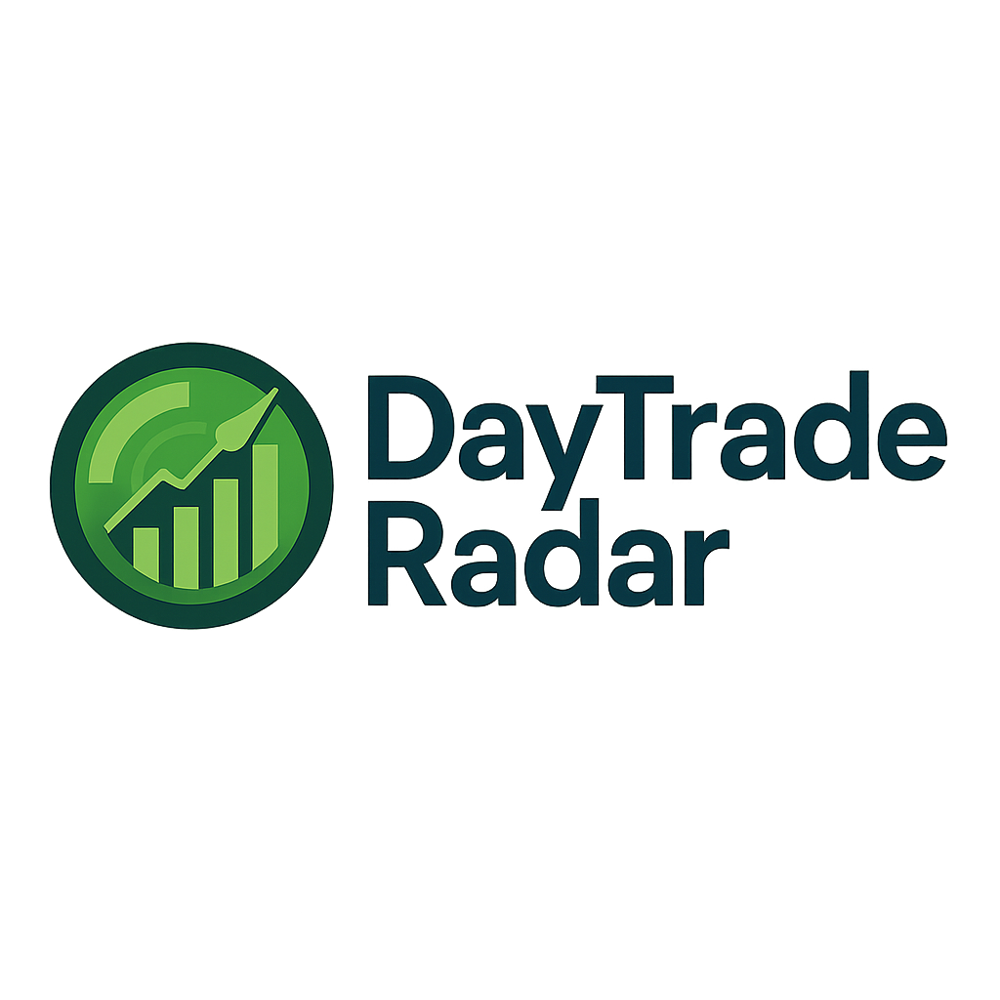

# DayTradeRadar

DayTradeRadar is a fast, intuitive stock scanner designed for day traders. It scans markets in real-time to identify high-potential stocks for intraday trading, delivering clear, actionable advice on which stocks are "hot" for trades based on momentum, volume, and key technical signals.


### ✅ Install Full Requirements
If you haven’t already, install all required dependencies using the `requirements.txt` file:
```bash
pip install -r requirements.txt
```

Your `requirements.txt` should include:
```
alpaca-trade-api
polygon
newsapi-python
tweepy
textblob
pandas
numpy
ta
sqlalchemy
joblib
tzlocal
pytz
```

---


